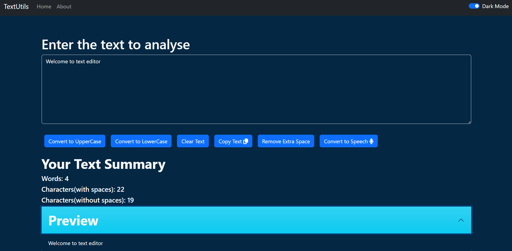

# TextUtils-React app

## Visit the App
[Click here to visit the Text Editor React App](https://lalitkishor9.github.io/TextUtils-React/)

## Preview

## Features

### Text Editing Tools
1. **Text-to-Speech**: Convert text to speech.
2. **Convert to Uppercase**: Transform text to uppercase.
3. **Convert to Lowercase**: Transform text to lowercase.
8. **Remove Extra Space**: Trim extra spaces from the text.
9. **Copy Text**: Copy the edited text to the clipboard.
10. **Clear Text**: Clear the text area.

### Text Analysis
1. **Words**: Calculate the number of words in the text.
2. **Characters**: Calculate the number of characters in the text.

## Usage
- Visit the [Text Editor React App](https://lalitkishor9.github.io/TextUtils-React/).
- Enter or paste your text into the text area.
- Use the provided tools to edit and analyze the text.
- Explore the various features to manipulate and understand your text.

## Development
- This project was built using React.
- You can explore the source code on [GitHub](https://lalitkishor9.github.io/TextUtils-React/).
